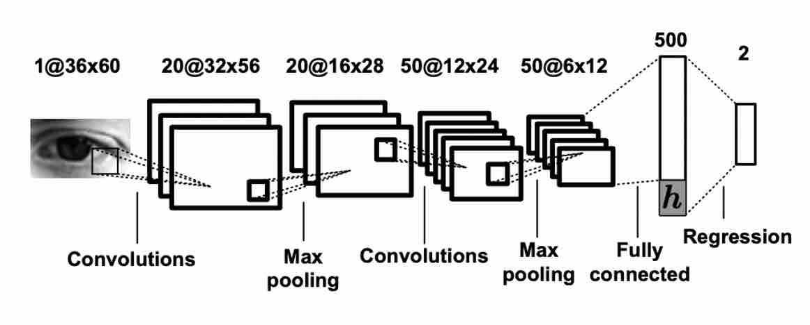

# Eye Gaze Estimation

### 1. Project Overview

This is a research topic in computer vision to predict **where** a person is looking at given the person’s full face. 

Generally, there are two directions of the task:

- 3-D gaze vector estimation is to predict the gaze vector, which is usually used in the automotive safety.
-  2-D gaze position estimation is to predict the horizontal and vertical coordinates on a 2-D screen, which allows utilizing gaze point to control a cursor for human-machine interaction.

Given the training dataset, we can resolve two types of problems: single-eye gaze estimation and two-eye gaze estimation. Apparently, this means our task is to predict one eye gaze direction or both eye. 

Usability: Track the eye movement, provide detailed insights into users' attention.

Challenges: (a) low sensor quality or unknown/challenging environments, and (b) large variations in eye region appearance.

### 2. Related work

#### 2.1 Gaze Estimation Methods

There are two wildly accepted methods for estimating gaze direction: **model-based** and **appearance-based**. Model-based method uses 3D eyeball models and estimate the gaze direction using geometric eye features, while appearance-based method learns generic gaze estimators from large amounts of person, and head pose-independent training data.

Model-based method largely depend on the requirement of external light source to detect eye feature so the modelling process could be a complexing one, and the accuracy for this method is still lower and the robustness is unclear.[1] Appearance-based gaze estimation methods directly use eye images as input and can therefore potentially work with low-resolution eye images. Since the eye images contain many information, so this method needs large amount of data than model-based for the training process.

#### 2.2 Dataset collection 

The Eyediap[2] dataset contains 94 video sequences of 16 participants looking at three different targets. So the gaze direction can be very limited and coarse and can't train a generalized gaze estimator. The UT Multiview[3] dataset collected 50 participants and can be used to sythesise images for head poses. But the problem for these two dataset is that they both record the gaze images under contolled laboratory environment.

The MPIIGaze[1] gaze dataset is used in the task for two reasons: 

- It's recorded outside the lab: when people are at home doing their work, the application on **laptop** capture the images.
- It takes months to record the data, so it contains wider range of recording locations and times, illuminations, and eye appearances.

The MPIIGaze dataset details are shown below:

- 15 participants, 213,659 pictures

- outside of laboratory conditions, i.e during daliy routine
- wilder range of recording location, time, illumination and eye appearance

How to collect: use of laptop application to let volunteers to look at a fixed place, and take pictures of their eyes. (Laptops are suited for long-term daily recordings but also because they are an important platform for *eye tracking application*.)

#### 2.3 Calibration Settings

No matter model-based or appearance-based methods, they both need to collect person-specific data during a calibration step. Previous works on gaze estimation didn't take person-specific caliberation settings into consideration. 

But for the MPIIGaze dataset, since they were collected using different laptops, so the screen size, resolution would be different. Furthermore, the camera coordinate system can also be wide-ranging. What their team did was to obtain the intrinsic parameters for the laptops. In this way, we can add the influence of participant-specific data into our model: 3D positions of each screen plane were estimated using a mirror-based calibration method.

To summarize, MPIIGaze dataset is giving images of the face, calibration settings for a specific participant, 3D gaze vectors of eyes, which is the ground truth for the problem.

### 3. Method

The task is generally divided into two parts: determine single eye gaze direction for one person, and determine directions for both eyes. Each problem has distinctive method to resolve it.

#### 3.1 Single-eye problem

##### 3.1.1 Problem analysis

For single-eye problem, the overview of the task is to predict a 3D gaze direction for one person, given his face image and head pose information. In the MPIIGaze dataset, the head pose was calculated by the calibration parameters, and the eye is extracted from the face image so we can just focus on the eye image for prediction instead of the whole face. Predicting an eye gaze direction from a single image can be difficult, because the conditions of the images can be very different: illuminations, eye glasses, image resolution. 

To properly learn the image attribute, we apply to Deep Learning algorithms with efficiently learn the features in quick time. I followed the guidance[1] of building a multi-modal CNN, the general process is shown in Fig.1. Before the training for CNN model starts, we should preprocess the data from the dataset, that is to first detect the face from the input raw image, then use the calibration parameters to derive 3D head rotation $r$. Then is the normalisation process for eye image is to adjust the head pose direction so as to directly pointing at the camera, so each input image can be executed in the same coodrinate system.

Fig.1 Workflow of gaze estimation

##### 3.1.2 Head pose Estimation 

We didn't directly get the head pose rotation from the record. It's calcualted from the calibartion parameters like screen size and intrinsic parameters from each participant's laptop camera. Since the camera can't directly point at the object, we will need to use images of Planar Mirror Reflections and to calculate the head pose vectors. Head pose could be influential for the model establishment, this would be covered in the discussion part.

##### 3.1.3 Normalisation

The purpose for normalisation process is to adjust the head pose direction. From the dataset we can see that the range for the head poses go wide, so the head is not always directly pointing at the camera shoot. The consequence of being in this form would reduce the accuracy for the training process because the angle of the head coordinate and the camera coordinate would influence the image representation: we need the eye image which the head coodinate's z-axis should be perpendicular to the camera coordinate panel. After the normalisation process, we can get the grey image for both eyes and head pose vectors $h$. The transforming process is shown below: 

  
Fig.2 Normalisation process

##### 3.1.4 Multi-modal CNN

The task for the CNN is to learn the mapping from the input feature. The network architecture here is the adaptation from LeNet framework. We have two input data for this model: the normalised eye image and the 2D head pose vectors, and the model would output the predicting 2D gaze vector. Here we need to convert all the 3D vectors into 2D vectors. The differences of using 2D or 3D would also be dicussed in part 5. 

  
Fig.3 Multi-modal CNN

#### 3.2 Two-eye problem 

##### 3.2.1 Problem analysis

Two-eye asymmetry: 

##### 3.2.2 Knowledge 

##### 3.2.3 AR-E Net

### 4. Evaluation

#### 4.1 Unified Measurement

To examine the model result for each training using different loss functions, gradient descents and other factors that might affect the output, we should be setting a criteria for the measurement. So the degree mean error which is to calculate the angle between two vectors is applied here. 

Let’s say two **normalised** vectors $p_1=(x_1,y_1,z_1 )$, $p_2=(x_2,y_2,z_2 )$, the angle is:

$ angle= ∑_{i=0}^3(p_1 [i]∗p_2 [i])$. Note we should be getting the normalised vectors here, otherwise the calculated angular erorrs can be far-fecthing.

We also need to convert angles into degree, the format is: $degree= arccos⁡(angle)∗180÷\pi $.

#### 4.2 Hyper parameters

Under the best model for single-eye estimation, the batch size is 512, adn the learning rate is setted to be 0.0001. The loss function applied is SmoothL1Loss, and the optimizer is adamGrad. For the data splitting, I tried random splitting and splitting by person, the latter one get better result.

#### 4.3 Validation 

I implemented K-fold validation for the single-eye model, which is to elicit $1/k$ data points from the dataset and use it as the validation data, the rest of the data is for trainning. For k = 5, got the best result at 7.82 (not improve so much). For k = 3, got best result at 8.97. For k = 10, got best result at 9.69. 

Fig. K-fold validation outcome

#### 4.4 Result 

**Single-eye problem**

The train-test curve is showing the trend in the below graph. Generally, the curve for both training loss and test loss are decreasing after more training times. The zigzags in the curve could be generated by the mini-batch training and adam grad. The best outcome ever for the single-eye  model is 8.92.

**Two-eye problem**

### 5. Discussion

#### 5.1 Influence from head pose 

#### 5.2 Influence from dimensions of vectors 

### 6. Conclusion

### 7. Timeline

Week 3: Dataset observation, a general understanding of the problem.

Week 4: Determine method to be used, dataset exploration.

Week 5: In-depth learn *Appearanced-based gaze in-the-wild*[1].

Week 6: Implement a multi-modal CNN for single-eye gaze estimation.

Week 7: think of relationship and influence that 3D head pose, 3D gaze vectors. Code to prove the thinking.

Week 8: improve some techniques applied to the data. (Normalize the vector, change of judging metrics) 

Week 9-10: Validation process(K-fold validation), improve the result by tuning hyper-parameters.

Week 11:  start of two-eye mission. Run model on left eye and right ey separately.  

Week 12: Learn Asymmetry technique, Read the paper.[2]

Week 13: implementing AR-Net.

### 8. Problems 

### 9. Environment

|       |      |        |                      |       |            |
| ----- | ---- | ------ | -------------------- | ----- | ---------- |
| cgpb0 | 1    | Ubuntu | 2x  Xeon Silver 4210 | 256GB | 3.2TB  SSD |

### 10. File description 

### Appendix

[1] Zhang, Xucong, et al. "Appearance-based gaze estimation in the wild." *Proceedings of the IEEE conference on computer vision and pattern recognition*. 2015.

[2] Funes Mora, Kenneth Alberto, Florent Monay, and Jean-Marc Odobez. "Eyediap: A database for the development and evaluation of gaze estimation algorithms from rgb and rgb-d cameras." *Proceedings of the Symposium on Eye Tracking Research and Applications*. 2014.

[3] Sugano, Yusuke, Yasuyuki Matsushita, and Yoichi Sato. "Learning-by-synthesis for appearance-based 3d gaze estimation." *Proceedings of the IEEE Conference on Computer Vision and Pattern Recognition*. 2014.