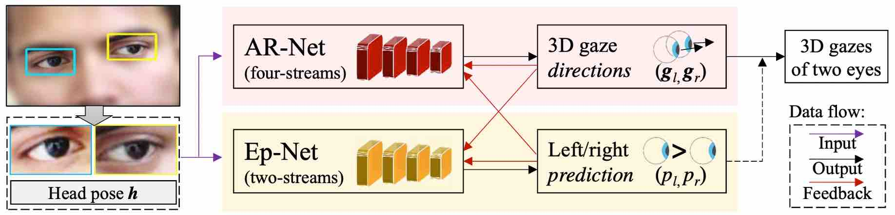
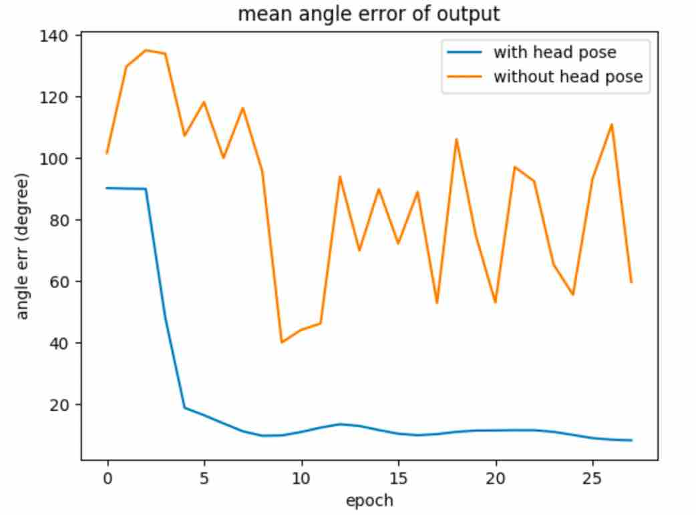
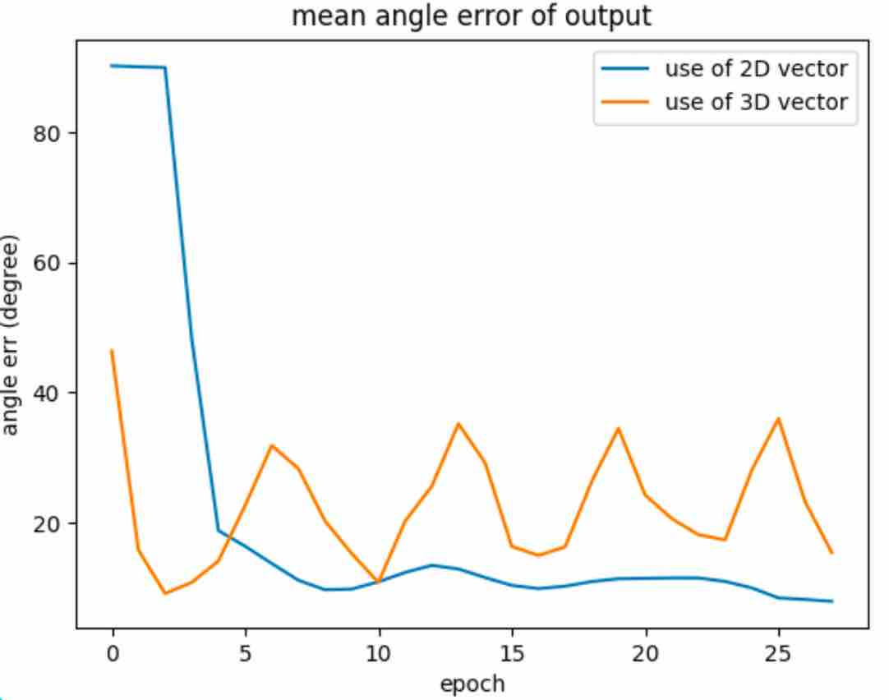

# Eye Gaze Estimation

### 1. Project Overview

This is a research topic in computer vision to predict **where** a person is looking at given the person’s full face. 

Generally, there are two directions of the task:

- 3-D gaze vector estimation is to predict the gaze vector, which is usually used in the automotive safety.
-  2-D gaze position estimation is to predict the horizontal and vertical coordinates on a 2-D screen, which allows utilizing gaze point to control a cursor for human-machine interaction.

Given the training dataset, we can resolve two types of problems: single-eye gaze estimation and two-eye gaze estimation. Apparently, this means our task is to predict one eye gaze direction or both eye. 

Usability: Track the eye movement, provide detailed insights into users' attention.

Challenges: (a) low sensor quality or unknown/challenging environments, and (b) large variations in eye region appearance.

### 2. Related work

#### 2.1 Gaze Estimation Methods

There are two widely accepted methods for estimating gaze direction: **model-based** and **appearance-based**. Model-based method uses 3D eyeball models and estimate the gaze direction using geometric eye features, while appearance-based method learns generic gaze estimators from large amounts of person, and head pose-independent training data.

Model-based method largely depend on the requirement of external light source to detect eye feature so the modelling process could be a complexing one, and the accuracy for this method is still lower and the robustness is unclear.[1] Appearance-based gaze estimation methods directly use eye images as input and can therefore potentially work with low-resolution eye images. Since the eye images contain many information, so this method needs large amount of data than model-based for the training process.

#### 2.2 Dataset collection 

The Eyediap[2] dataset contains 94 video sequences of 16 participants looking at three different targets. So the gaze direction can be very limited and coarse and can't train a generalized gaze estimator. The UT Multiview[3] dataset collected 50 participants and can be used to sythesise images for head poses. But the problem for these two dataset is that they both record the gaze images under contolled laboratory environment.

The MPIIGaze[1] gaze dataset is used in the task for two reasons: 

- It's recorded outside the lab: when people are at home doing their work, the application on **laptop** capture the images.
- It takes months to record the data, so it contains wider range of recording locations and times, illuminations, and eye appearances.

The MPIIGaze dataset details are shown below:

- 15 participants, 213,659 pictures

- outside of laboratory conditions, i.e during daliy routine
- wider range of recording location, time, illumination and eye appearance

How to collect: use of laptop application to let volunteers to look at a fixed place, and take pictures of their eyes. (Laptops are suited for long-term daily recordings but also because they are an important platform for *eye tracking application*.)

#### 2.3 Calibration Settings

No matter model-based or appearance-based methods, they both need to collect person-specific data during a calibration step. Previous works on gaze estimation didn't take person-specific caliberation settings into consideration. 

But for the MPIIGaze dataset, since they were collected using different laptops, so the screen size, resolution would be different. Furthermore, the camera coordinate system can also be wide-ranging. What their team did was to obtain the intrinsic parameters for the laptops. In this way, we can add the influence of participant-specific data into our model: 3D positions of each screen plane were estimated using a mirror-based calibration method.

To summarize, MPIIGaze dataset is giving images of the face, calibration settings for a specific participant, 3D gaze vectors of eyes, which is the ground truth for the problem.

### 3. Method

The task is generally divided into two parts: determine single eye gaze direction for one person, and determine directions for both eyes. Each problem has distinctive method to resolve it.

#### 3.1 Single-eye problem

##### 3.1.1 Problem analysis

For single-eye problem, the overview of the task is to predict a 3D gaze direction for one person, given his face image and head pose information. In the MPIIGaze dataset, the head pose was calculated by the calibration parameters, and the eye is extracted from the face image so we can just focus on the eye image for prediction instead of the whole face. Predicting an eye gaze direction from a single image can be difficult, because the conditions of the images can be very different: illuminations, eye glasses, image resolution. 

To properly learn the image attribute, we apply to Deep Learning algorithms with efficiently learn the features in quick time. I followed the guidance[1] of building a multi-modal CNN, the general process is shown in Fig.1. Before the training for CNN model starts, we should preprocess the data from the dataset, that is to first detect the face from the input raw image, then use the calibration parameters to derive 3D head rotation $r$. Then is the normalisation process for eye image is to adjust the head pose direction so as to directly pointing at the camera, so each input image can be executed in the same coodrinate system.


<div style="text-align: center;">Fig.1 Workflow of gaze estimation</div>

##### 3.1.2 Head pose Estimation 

We didn't directly get the head pose rotation from the record. It's calcualted from the calibartion parameters like screen size and intrinsic parameters from each participant's laptop camera. Since the camera can't directly point at the object, we will need to use images of Planar Mirror Reflections and to calculate the head pose vectors. Head pose could be influential for the model establishment, this would be covered in the discussion part.

##### 3.1.3 Normalisation

The purpose for normalisation process is to adjust the head pose direction. From the dataset we can see that the range for the head poses go wide, so the head is not always directly pointing at the camera shoot. The consequence of being in this form would reduce the accuracy for the training process because the angle of the head coordinate and the camera coordinate would influence the image representation: we need the eye image which the head coodinate's z-axis should be perpendicular to the camera coordinate panel. After the normalisation process, we can get the grey image for both eyes and head pose vectors $h$. The transforming process is shown below: 


  <div style="text-align: center;">Fig.2 Normalisation process</div>

##### 3.1.4 Multi-modal CNN

The task for the CNN is to learn the mapping from the input feature. The network architecture here is the adaptation from LeNet framework. We have two input data for this model: the normalised eye image and the 2D head pose vectors, and the model would output the predicting 2D gaze vector. Here we need to convert all the 3D vectors into 2D vectors. The differences of using 2D or 3D would also be dicussed in part 5. 


  <div style="text-align: center;">Fig.3 Multi-modal CNN</div>

#### 3.2 Two-eye problem 

##### 3.2.1 Problem analysis

The two-eye gaze estimation is to predict the gaze vectors for left eye and right eye for one face image. The MPI Team have made some assumptions on this: 

- User head pose can be obtained by using existing head trackers; 
- The user should roughly fixate on the same targets with both eyes.

There have been some works on the two-eye problem. In 2017’s paper *MPIIGaze: Real-World Dataset and Deep Appearance-Based Gaze Estimation*[4],  it proposed a method that set the ground truth of both eyes. They newly defined a ground truth: mean gaze vector as the output of the defining model. Through several trials, they got a rough conclusion that two-eye estimation can improve the predicted result.

From the above conclusion, we know that we can predict the vectors for two eyes at one time in order to revise the outcome for predicting single gaze vectors. 

#### 3.2.2 Knowledge 

In the previous work for two-eye gaze estimation, two eyes are treated indifferently. But from the observation of some statistics, we can find that we cannot expect the same accuracy for two eyes, either eye has a chance to be more accurate. This observation is called two-eye asymmetry, and it's caused by the very different head poses, image qualities, and illumination on the face. 

##### 3.2.3 AR-E Net

AR-E net was proposed by *Appearance-Based Gaze Estimation via Evaluation-Guided Asymmetric Regression*[4]. This net is built by AR-Net and Ep-Net. Two nets have different functions. 

##### 

  <div style="text-align: center;">Fig.4 Architecture for AR-E Net </div>

For AR-Net (Asymmetric Regression-Net), it's to predict two gaze vectors for both left and right eyes simultaneously. The salient difference compared to previous network is the loss function. AR-Net would calculate the acrcosine value for both eyes, and set them as weight in the loss function. 

E-Net(Evaluation-Net) was to help further decide which eye is more reliable. It would append AR-Net and give feedback to it. 

### 4. Experiments and evaluation

#### 4.1 Unified Measurement

To examine the model result for each training using different loss functions, gradient descents and other factors that might affect the output, we should be setting a criteria for the measurement. So the degree mean error which is to calculate the angle between two vectors is applied here. 

Let’s say two **normalised** vectors $p_1=(x_1,y_1,z_1 )$, $p_2=(x_2,y_2,z_2 )$, the angle is:

$ angle= ∑_{i=0}^3(p_1 [i]∗p_2 [i])$. Note we should be getting the normalised vectors here, otherwise the calculated angular erorrs can be far-fecthing.

We also need to convert angles into degree, the format is: $degree= arccos⁡(angle)∗180÷\pi $.

#### 4.2 Hyper parameters

Under the best model for single-eye estimation, the batch size is 512, adn the learning rate is setted to be 0.0001. The loss function applied is SmoothL1Loss, and the optimizer is adamGrad. For the data splitting, I tried random splitting and splitting by person, the latter one get better result.

#### 4.3 Validation 

For the validation process, I tried different dataset spliting method. In general, it can be classified as split by people and random spliting. Split by people was to elict data for one person as validation data, and rest of them are all for training. In this way, each hypothesis would be using different size of validation data. Don't know if this fluctuation would affect the result. 

I implemented **K-fold validation** for the single-eye model (randomly split the dataset), which is to elicit $1/k$ data points from the dataset and use it as the validation data, the rest of the data is for trainning. For k = 5, got the best result at 7.82 (not improve so much). For k = 3, got best result at 8.97. For k = 10, got best result at 9.69. The MPI team had 6.3[1] mean degree error for this model.


<div style="text-align: center;">Fig.5 K-fold validation outcome</div>

#### 4.4 Result 

**Single-eye problem**

I applied the previous mentioned multi-modal CNN in my work. The train-test curve is showing the trend in the below graph. It took 100 epochs to train the model. Generally, the curve for both training loss and test loss are decreasing after more training times. The zigzags in the curve could be the result of the mini-batch training and adam grad. The best outcome ever for the single-eye model is 8.92.


<div style="text-align: center;">Fig.6 train-test loss curve</div>

**Two-eye problem**

For the two-eye problem, I first tried to use model for single-eye problem and separately predict the gaze vectors for both eyes, but the result is not always closed, this can also reveal the conclusion from MPI team, which is: we can't treat two eyes indifferently. Then I tried to combine two streams of the single-eye model together (they are to seperatly predict left and right eyes), concatenate their result and redifine the loss function as an AR-Net's form. In this way, the result didn't go well as it never convergent. Then I follow the rules by standard ARE-Net and implement the AR-Net (failed to run E-Net because CUDA are always out of memory.) For now, the best accuracy for two-eye problem stops at 13.4104.


### 5. Discussion

In this part, we dicuss about several effects that might influence the accuracy of our model. 

#### 5.1 Influence from head pose 

Head pose is needed both in single-eye problem and two-eye problem. However, the problem is that, since we have normalised our data and will feed them into our network, why is still necessary to inject head poses to help us predict? This puzzle can be relieved by theoretical analysis: Normalised images was to make the eye directly looking at the camera, but we are not predicting the gaze vectors in this senario, instead, we are predicting the gaze directions for the original photos, in which the head pose would affect the final result. Leave alone head poses can have terrible of the training result, as shown in the following graph:



<div style="text-align: center;">Fig.7 comparing result for whether head pose is added</div>

#### 5.2 Influence from dimensions of vectors 

To emphasise the necessity of using 2D vectors, I tried to use vectors with different dimensions to see the training outcome. From fig.8 we can clearly see that using 2D could convergent with no more than 10 epochs, while 3D vectors would never be like that. However, this could only indicate that this particular network structure would only be suitable for 2D vectors instead of 3D.



<div style="text-align: center;">Fig.8 comparing results for using 3D and 2D vectors</div>

#### 5.3 Determine two-eye ground truth 

For the two-eye estimation problem, In th  2017’s paper *MPIIGaze: Real-World Dataset and Deep Appearance-Based Gaze Estimation*, they propose a method that set the ground truth of both eyes, which is, the mean gaze vector originating from the centre of both eyes is defined as ground-truth of gaze vectors. Nonetheless, this can't acurrately represent the true relationship between two eyes. Instead, we should collect data for both eyes separately.


### 6. Conclusion

MPIIGaze dataset is collected through long observations on various volunteers. The wider range of various factors make it predominant in deep learning model training. To predict the gaze vector for a  single eye, we need to convert both 3D gaze vectors (ground truth) and calculated head poses into 2D version. In this way, we can reduce the calculation complexity and also have better results for prediction. The convert process contains geometric formula and needed to be implemented using cv library. This CNN-based model takes less time to train, and can also reach high quality results. 

Two-eye gaze estimation is more like an adjustment of the original result for single-eye prediction. It combines the two images and take the inter-relationship and discrepancies of two eyes into consideration. Instead of just output the raw result, this problem mainly discuss how can the predicting results feedback to the training process and have a better outcome after the adjustments. 


### 7. My work 

| Week time | Main task                    | <center>Details</center>                                     |
| --------- | ---------------------------- | ------------------------------------------------------------ |
| 3         | Lead in to the project       | - Search for previous works on gaze estimation, build a basic understanding of the problem;<br />- Look for available datasets and manageable methods for problem solving. |
| 4         | EDA                          | - Determine the method to be applied to;<br />- Explore the attributes and characteristics of the dataset, understand the labels. <br />- Understand the dataset collecting process. |
| 5         | Learn multi-modal CNN[1]     | - Get familiar with the process of using calibration parameters to calculate head pose rotations and normalising the images;<br />- Understand the deep learning architecture and clarify the possible problems. |
| 6         | Implement CNN[1]             | - Based on PyTorch, Implement the multi-modal CNN with normalised images;<br />- Train the model with the dataset (dataset spliting: random spliting) |
| 7         | Discuss about the facts      | - Consider the influence of the dimension of the vectors and head poses for the model;<br/>- Coding to prove the thinking;<br/>- Revise the dataset spliting method. <br />- Change to GPU device.
| 8         | Improve the Result           | - Look into the bad prediction and find possible causes;<br/>- Adjust the hyperparameters and optimzers;<br/>- Use of new judging metrics (mean degree error). |
| 9-10      | Evaluation                   | - Do the validation process, implement K-fold validation process. |
| 11        | Start of two-eye problem     | - Run a model to predict two eye's vectors separately;<br/>- Implement a CNN (by self) based on previous architecture;<br/>- Analyze the problems occured in the two models. |
| 12        | Learn Asymmetry technique[5] | - Learn the architecture of AR-E Net.                        |
| 13        | Implement AR-Net             | - Based on the paper[5], implement AR Net; <br/>- Tune the structure and improve the result. |


### 8. Limitations

1. The model for single-eye problem hasn't go through cross-dataset validation. If applicable, can use other datasets like Eyediap[2] to test the model outcome, so to improve the architecture's generalization ability.
2. The self-designed CNN didn't work well in predicting the result, further adjustment and revision is needed in order to better run the model.
3. The AR-E Net costs too much memory when training the model, So during my work, CUDA is out of memory and can not go on training it. AR-E Net is relatively complex, a simpler but also effective model is needed to address the two-eye problem.
4. This project didn't do much about decrease noises in the training image. However the poor illuminations, coverings like eye-glasses can reduce the accuracy of the CNN, so for further work, the preprocess metrics for the dataset is needed. 


### 9. Environment

|       |      |        |                      |       |            |
| ----- | ---- | ------ | -------------------- | ----- | ---------- |
| cgpb0 | 1    | Ubuntu | 2x  Xeon Silver 4210 | 256GB | 3.2TB  SSD |


### 10. Directory description 

```
+--EyeGaze # root 
| +--essay # essays related 
| +--note # literature review on essays
| +--pre # presentation slides
| +--single_eye_normalized
	| +--gpu # code suitable for cuda 
	| +--train_cpu # training on cpu device
	| +--validation 
	| +--visualize # draw curves
| +--src
| +--two_eye
```


### Appendix

[1] Zhang, Xucong, et al. "Appearance-based gaze estimation in the wild." *Proceedings of the IEEE conference on computer vision and pattern recognition*. 2015.

[2] Funes Mora, Kenneth Alberto, Florent Monay, and Jean-Marc Odobez. "Eyediap: A database for the development and evaluation of gaze estimation algorithms from rgb and rgb-d cameras." *Proceedings of the Symposium on Eye Tracking Research and Applications*. 2014.

[3] Sugano, Yusuke, Yasuyuki Matsushita, and Yoichi Sato. "Learning-by-synthesis for appearance-based 3d gaze estimation." *Proceedings of the IEEE Conference on Computer Vision and Pattern Recognition*. 2014.

[4] Zhang X, Sugano Y, Fritz M, et al. Mpiigaze: Real-world dataset and deep appearance-based gaze estimation[J]. IEEE transactions on pattern analysis and machine intelligence, 2017, 41(1): 162-175.

[5] Cheng Y, Lu F, Zhang X. Appearance-based gaze estimation via evaluation-guided asymmetric regression[C]//Proceedings of the European Conference on Computer Vision (ECCV). 2018: 100-115.
